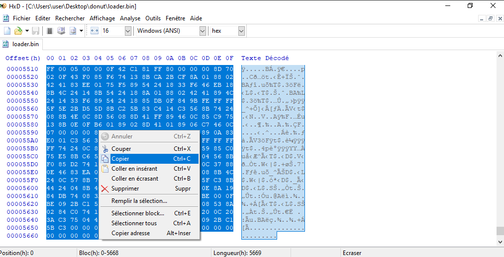
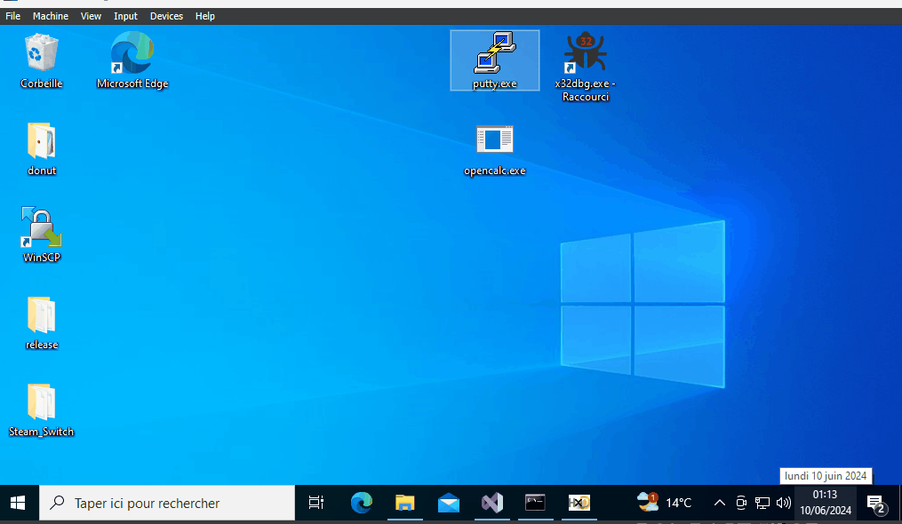
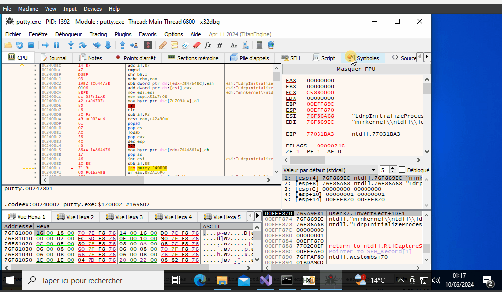
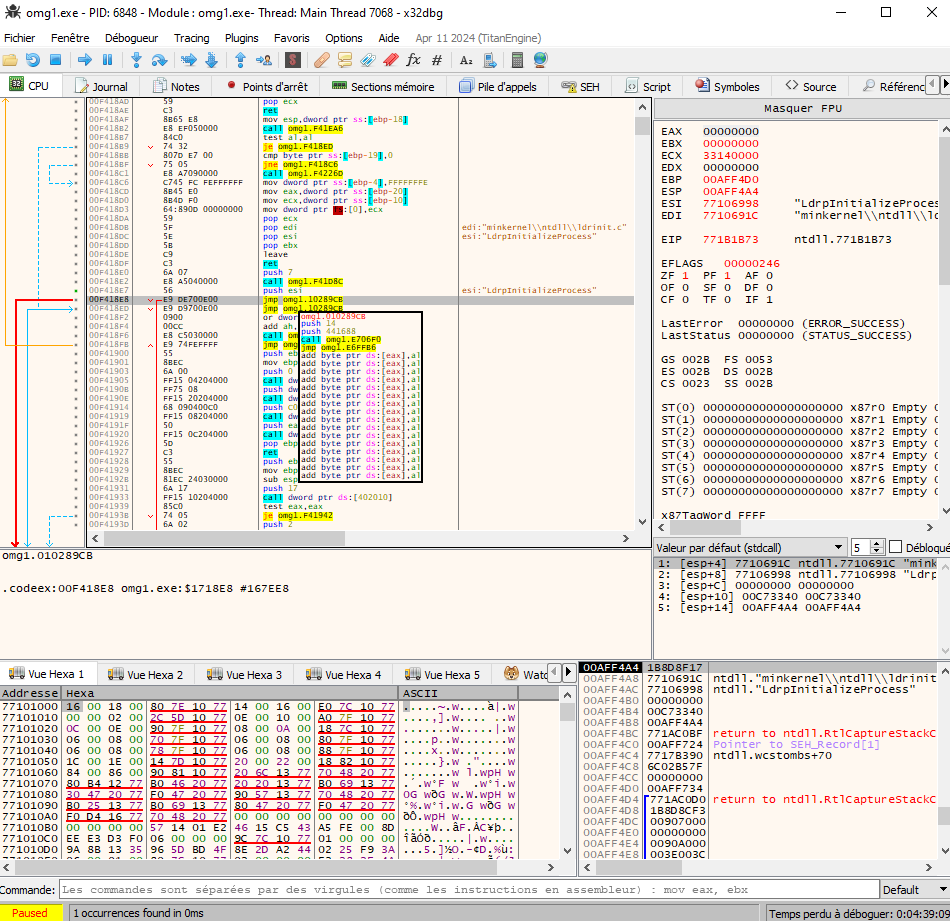

### PoC

Voici ce que je veux faire :

- Créer une application c++ (ici, ouvrir la calculatrice)
- Sortir le shellcode avec le donut de `opencalc.exe`.
- Sortir les octets de ce shellcode
- Décompiler putty, mettre le shellcode à l'intérieur
- Exécutez le shellcode, puis passez à l'exécution de putty.

Double-cliquez sur putty pour ouvrir la calculatrice et putty.

### Explication rapide :

D'après ce que j'ai compris, donut génère un shellcode du PE donné. Mais aussi un loader qui sera utilisé pour injecter le shellcode dans le programme.

Le chargeur "crée" le programme original (octets par octets) dans le thread putty.

Un chargeur se trouve autour du shellcode pour le charger dans Putty (sans lui, il n'y a pas de point d'entrée)

Chaque programme compilé a un code de retour pour l'exécution. ce retour va tuer le thread.

Notre programme (`opencalc.exe`) a un `return 5520`.

avec une option)


Le défi consiste à charger le shellcode (avec ou sans retour) dans putty. Continuez à exécuter le shellcode jusqu'à la fin, ou dans un nouveau thread qui ne se tuera pas tout seul, si vous le souhaitez.
Enfin, une fois ceci fait, nous passerons aux premières instructions de putty pour continuer à exécuter putty.


### Problèmes rencontrés :

- J'ai essayé de modifier le `return 5520` de mon programme en le décompilant, car c'est nécessairement le premier return qui arrive.
    - Si je peux passer à la première instruction de putty au lieu de faire le `return 5520`, je l'ai.
Le problème est que le loader charge le shellcode dans une zone de la mémoire qui ne peut pas être écrite, donc on ne peut pas sauter à partir de là.


- J'ai modifié `return 5520` en décompilant `opencalc.exe`, j'ai remplacé les octets de retour par des octets nuls, puis j'ai patché le .exe.
    - J'enlève le shellcode, je colle et je patche putty. Et il y a bien une exception pour les octets nuls. Mais il y en a toujours dans le thread qui ne peuvent pas être écrits. Il est donc impossible de le modifier


- En me basant sur le principe ci-dessus, j'ai pensé sauter à l'offset de la première instruction putty, mais directement en décompilant `opencalc.exe` au lieu des octets nuls. Cette fois-ci, le problème est que `opencalc.exe` n'a pas la référence putty, donc je vais sauter aveuglément dans un offset qui est généré aléatoirement à chaque nouvelle exécution.


- Enfin j'ai généré le shellcode byte par byte, je retrouve les bytes qui servent a faire le `return 5520`.
    - En changeant ces bytes par un jump sur les instructions de putty, on obtient une exception.

C'est cette derniere methode que je vais montrer par en dessosu.

### Go

Voici le code de la calculatrice, j'ai intentionnellement mis un retour avec le nombre 5520 pour le retrouver facilement dans l'hexa.

Construit en 32bits avec Visual Studio.

```
#include <cstdlib>
#include <iostream>

int main() {
    system("calc");
    return 5520;
}

```


Ensuite on genere le shellcode

- On precise :
    - `-a 1` x86 application
    - `-k 2` Keep all
    - `-e 1` No Encryption
    - `-b 1` No bypass AV
    - `-f 1` Format Binairies


De la on va sortir les bytes du shellcodes avec HxD.  CTRL + A





On va décompiler Putty modifié avec le code cave (ici il le sera deja) c'est `.codeex`.
Et copié le shellcode dans la bonne zone de mémoire.
- J'ajoute `pushad` et `pushfd` au début de shellcode



Ensuite je vais modifier certaines instuctions à coté de l'entry point de putty.
Il faut sauvegarder les instructions pour les remettres a la fin du shellcode.

On va jump directement dans le shellcode.



Enfin a la fin du shellcode on va remettre les lignes changées durant le jump dans le shellcode. Ainsi on jump de nouveau au `push 0x1` pour revenir a l'endroit ou on a sauté au shellcode


Enfin on va comparer les bytes du shellcode a celui du programme original, on va ensuite trouver l'endroit ou le programme `opencalc.exe` se termine. (je le mets a l'endroit du exit)

On décompile `opencalc.exe`, et on cherche les bytes dans le shellcode.


Un fois trouvé on jump simplement sur les instructions de putty qu'on a remise.
Enfin on patch le projet.




## FIN

Dans la théorie, on peut avoir la calculette avant puis ça jump sur putty et le ui de putty se lance. 


Dans les faits la calculette se lance, et il y a une exception a la fin du shellcode de `opencalc.exe`.

A savoir que l'adresse de l'exception change a chaque nouvelle execution et des fois on est sur des plages qui n'existent pas.


L'execution en decompilant : 


