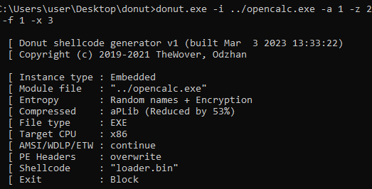
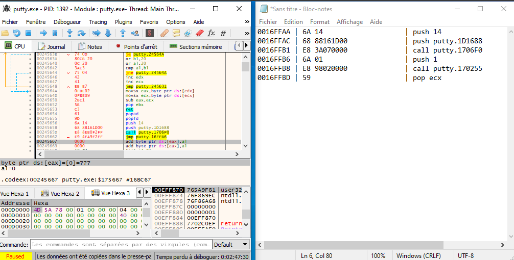

### PoC

Voici ce que je veux faire :

- Créer une application c++ (ici, ouvrir la calculatrice)
- Sortir le shellcode avec le donut de `opencalc.exe`.
- Sortir les octets de ce shellcode
- Décompiler putty, mettre le shellcode à l'intérieur
- Exécutez le shellcode, puis passez à l'exécution de putty.

Double-cliquez sur putty pour ouvrir la calculatrice et putty.

### Explication rapide :

D'après ce que j'ai compris, donut génère un shellcode du PE donné. Mais aussi un loader qui sera utilisé pour injecter le shellcode dans le programme.

On se retrouve avec 25 kB d'octets utilisés pour cela, et il faut beaucoup de temps pour l'analyser correctement.

Le chargeur "crée" le programme original (octets par octets) dans le thread putty.

Le shellcode n'a pratiquement aucun octet en commun avec le PE (`opencalc.exe`).
Cependant, une fois que le chargeur a chargé le shellcode dans le programme, les octets sont similaires au PE original décompilé (`opencalc.exe`).

Un shellcode comprend les octets d'exécution du programme. Ces octets n'ont absolument rien à voir avec les octets du programme original, ce sont des octets de construction pour le shellcode.

Un chargeur se trouve autour du shellcode pour le charger dans Putty (sans lui, il n'y a pas de point d'entrée).


Chaque programme compilé a un code de retour pour l'exécution. ce retour va tuer le thread.

Notre programme (`opencalc.exe`) a un `return 5520`.

avec une option).


Le défi consiste à charger le shellcode (avec ou sans retour) dans putty. Continuez à exécuter le shellcode jusqu'à la fin, ou dans un nouveau thread qui ne se tuera pas tout seul, si vous le souhaitez.
Enfin, une fois ceci fait, nous passerons aux premières instructions de putty pour continuer à exécuter putty.


### Problèmes rencontrés :

- Il est presque impossible (ou du moins je ne l'ai pas trouvé) de lire tout le loader et de trouver l'emplacement exact du shellcode (ce ne sont pas les mêmes octets que opencalc.exe) où se trouvent les instrcutions du processus kill.

- J'ai essayé de modifier le `return 5520` de mon programme en le décompilant, car c'est nécessairement le premier return qui arrive.
    - Si je peux passer à la première instruction de putty au lieu de faire le `return 5520`, je l'ai.
Le problème est que le loader charge le shellcode dans une zone de la mémoire qui ne peut pas être écrite, donc on ne peut pas sauter à partir de là.


- J'ai modifié `return 5520` en décompilant `opencalc.exe`, j'ai remplacé les octets de retour par des octets nuls, puis j'ai patché le .exe.
    - J'enlève le shellcode, je colle et je patche putty. Et il y a bien une exception pour les octets nuls. Mais il y en a toujours dans le thread qui ne peuvent pas être écrits. Il est donc impossible de le modifier


- En me basant sur le principe ci-dessus, j'ai pensé sauter à l'offset de la première instruction putty, mais directement en décompilant `opencalc.exe` au lieu des octets nuls. Cette fois-ci, le problème est que `opencalc.exe` n'a pas la référence putty, donc je vais sauter aveuglément dans un offset qui est généré aléatoirement à chaque nouvelle exécution.


### Go

Voici le code de la calculatrice, j'ai intentionnellement mis un retour avec le nombre 5520 pour le retrouver facilement dans l'hexagone.

Construit en 32bits avec Visual Studio.

```
#include <cstdlib>
#include <iostream>

int main() {
    system("calc");
    return 5520;
}

```
.

Ensuite on genere le shellcode

- On precise :
    - `-a 1` x86 application
    - `-z 2` Compression aPlib
    - `-x 3` Block dans le thread
    - `-f 1` Format Binairies

.


De la on va sortir les bytes du shellcodes avec HxD.  CTRL + A


.


On va décompiler Putty modifié avec le code cave (ici il le sera deja) c'est `.codeex`.
Et copié le shellcode dans la bonne zone de mémoire.
- J'ajoute `pushad` et `pushfd` au début de shellcode

.

Ensuite je vais modifier certaines instuctions à coté de l'entry point de putty.
Il faut sauvegarder les instructions pour les remettres a la fin du shellcode.

On va jump directement dans le shellcode.

.

Enfin a la fin du shellcode on va remettre les lignes changées durant le jump dans le shellcode. Ainsi on jump de nouveau au `push 0x1` pour revenir a l'endroit ou on a sauté au shellcode

.


A partir de la, je suis bloqué il faut retirer le `return 5520` de `opencalc.exe`. Et celui du loader, mais si je peux trouver l'endroit du shellcode qui build le `return 5520`, j'aurais juste a faire le jump a la fin du shellcode a cet endroit.


## Troobleshooting

### Si je lance putty avec ce que je viens de faire au dessus : 

.

- Le code de retour est 5520, on est dans sur le return du programme.

c'est trop du d'aller au bout du programme il y a trop d'instruction mais aps de panique regardez la deuxieme pour comprendre que meme si je trouve le return dans le tread, je ne pourrais pas ecrire.

### Si je casse le return 5520 directement dans le programme

On décompile opencalc.exe.
On va remplacer le `Exit` par des null bytes afin de provoquer une exeception.

.

J'en sors le shellcode et le je le mets dans putty similaire au tuto du dessus.

Puis on va décompiler le Putty avec le shellcode avec l'exception des null bytes

.

On tombe bien sur nos null bytes à partir de la ca serait gagné si a la place de ces null bytes je pouvais faire un jump vers la fin du shellcode (ou il a les instructions putty).

Mais la zone de mémoire etant le main thread, n'est pas ecrivable.

.

.
.
