### Explanation

Explanation with images of my procedure.

### Go

Here is the calculator code, I intentionally put a return with the number 5520 to easily find it in the hex.

Build in 32bits with Visual Studio.

```
#include <cstdlib>
#include <iostream>

int main() {
    system("calc");
    return 5520;
}

```
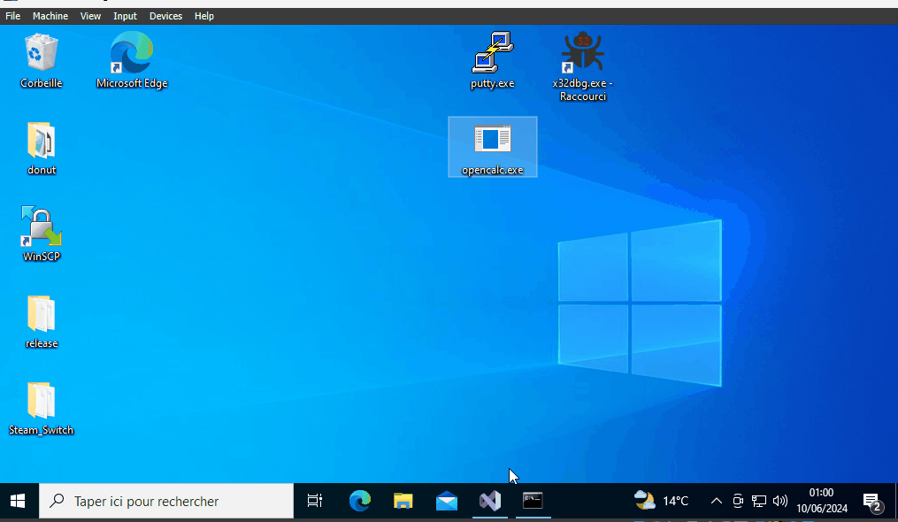.

Next, we generate the shellcode.

- Specify:
    - `-a 1` x86 application
    - `-z 2` aPlib Compression
    - `-x 3` Block in the thread
    - `-f 1` Binary Format

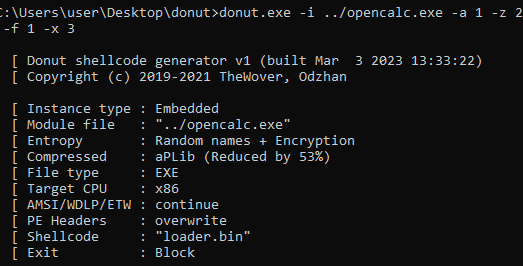.


From there, we will extract the shellcode bytes with HxD. CTRL + A


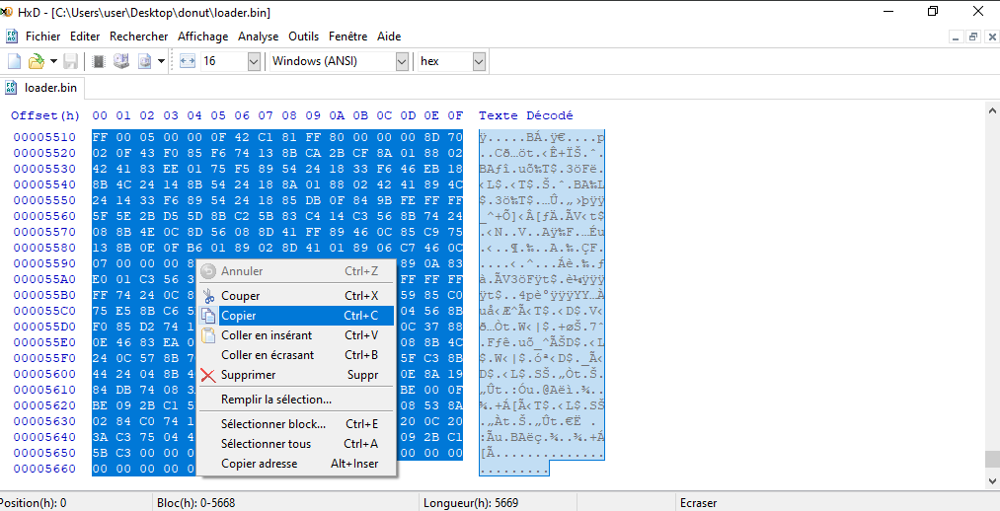.


We will decompile the modified Putty with the code cave (here it will already be) which is .codeex.
And copy the shellcode into the correct memory zone.

I add `pushad` and `pushfd` at the beginning of the shellcode.

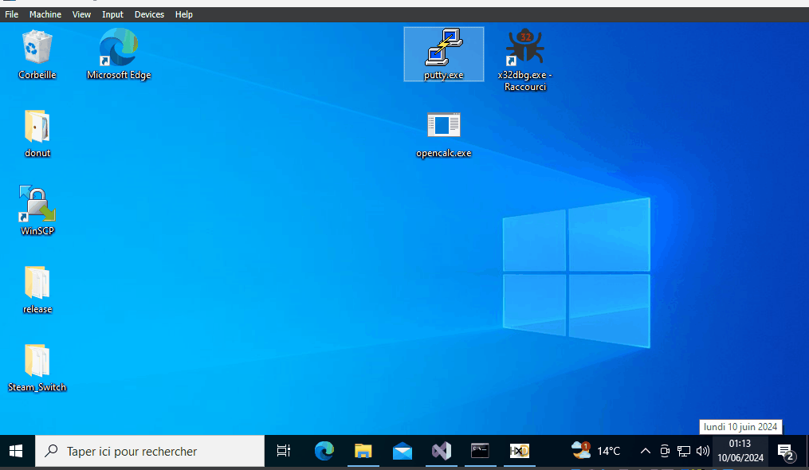.

Next, I will modify certain instructions next to Putty's entry point.
It is necessary to save the instructions to restore them at the end of the shellcode.

We will jump directly into the shellcode.

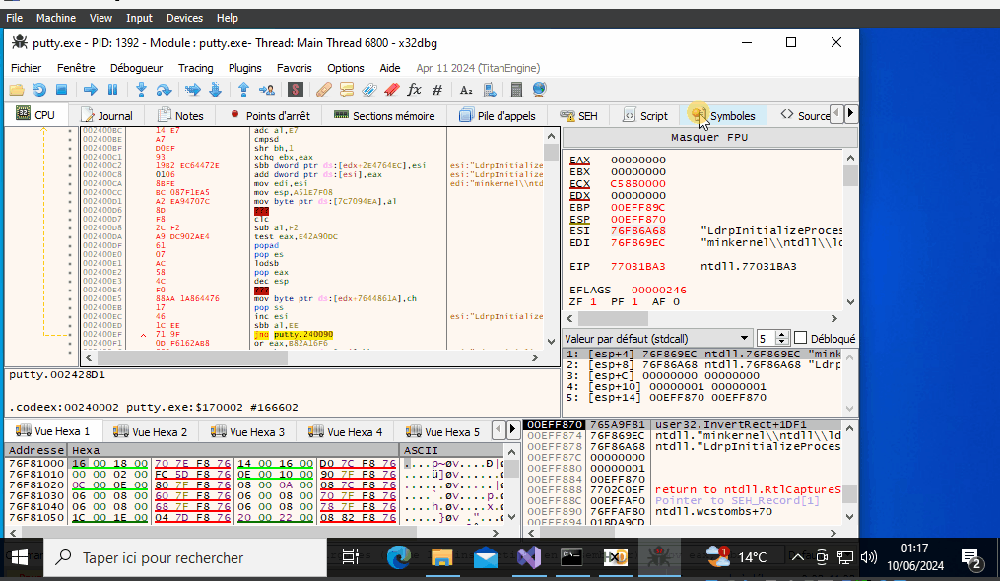.

Finally, at the end of the shellcode, we will restore the lines changed during the jump into the shellcode. Thus, we jump again to push 0x1 to return to the point where we jumped to the shellcode.

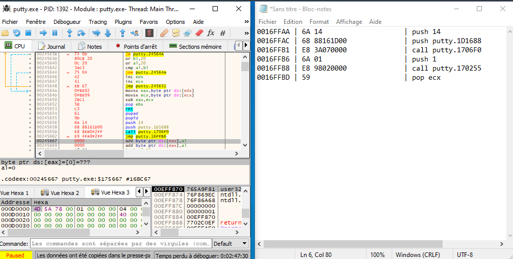.


From here, I am stuck; we need to remove the `return 5520` from `opencalc.exe`. And that from the loader, but if I can find the shellcode location that builds the `return 5520`, I would just need to jump at the end of the shellcode to this location.


## Troubleshooting
### If I run Putty with what I did above:

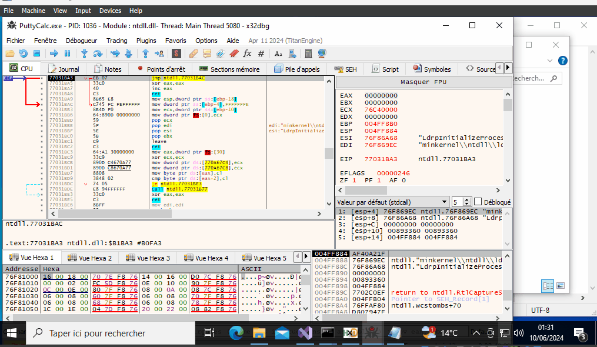.

- The return code is 5520, we are surely at the return of the program.

It’s too difficult to reach the end of the program because there are too many instructions, but don’t panic, look at the second one to understand that even if I find the return in the thread, I won’t be able to write.

### If I directly break the return 5520 in the program

We decompile opencalc.exe.
We will replace the Exit with null bytes to provoke an exception.

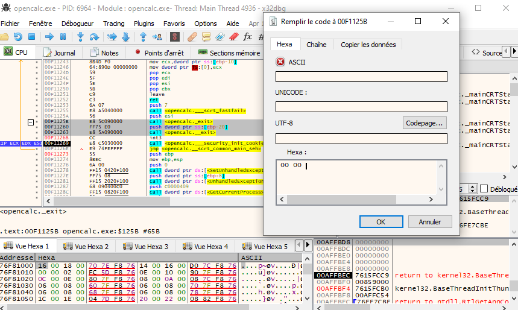.

I extract the shellcode and put it in Putty similar to the tutorial above.

Then we will decompile the Putty with the shellcode with the null bytes exception.

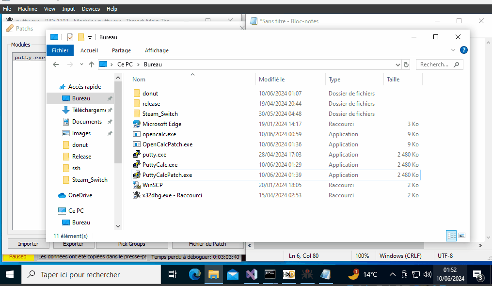.

We find our null bytes; from there, it would be a win if I could jump to the end of the shellcode (where the Putty instructions are) instead of these null bytes.

But the memory zone being the main thread, is not writable.

.

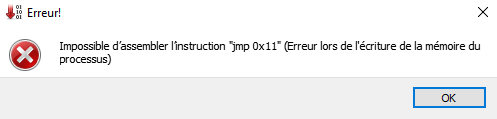.
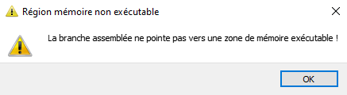.