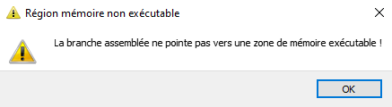

## Explication

Explication en image de ma procedure.


### Go

Voici le code de la calculette, j'ai fais exprès de mettre un return avec le chiffre `5520` pour mieux le retrouver dans l'hexa.

Build en 32bits. avec Visual Studio.

```
#include <cstdlib>
#include <iostream>

int main() {
    system("calc");
    return 5520;
}

```
.

Ensuite on genere le shellcode

- On precise :
    - `-a 1` x86 application
    - `-z 2` Compression aPlib
    - `-x 3` Block dans le thread
    - `-f 1` Format Binairies

.


De la on va sortir les bytes du shellcodes avec HxD.  CTRL + A


.


On va décompiler Putty modifié avec le code cave (ici il le sera deja) c'est `.codeex`.
Et copié le shellcode dans la bonne zone de mémoire.
- J'ajoute `pushad` et `pushfd` au début de shellcode

.

Ensuite je vais modifier certaines instuctions à coté de l'entry point de putty.
Il faut sauvegarder les instructions pour les remettres a la fin du shellcode.

On va jump directement dans le shellcode.

.

Enfin a la fin du shellcode on va remettre les lignes changées durant le jump dans le shellcode. Ainsi on jump de nouveau au `push 0x1` pour revenir a l'endroit ou on a sauté au shellcode

.


A partir de la, je suis bloqué il faut retirer le `return 5520` de `opencalc.exe`. Et celui du loader, mais si je peux trouver l'endroit du shellcode qui build le `return 5520`, j'aurais juste a faire le jump a la fin du shellcode a cet endroit.


## Troobleshooting

### Si je lance putty avec ce que je viens de faire au dessus : 

.

- Le code de retour est 5520, on est dans sur le return du programme.

c'est trop du d'aller au bout du programme il y a trop d'instruction mais aps de panique regardez la deuxieme pour comprendre que meme si je trouve le return dans le tread, je ne pourrais pas ecrire.

### Si je casse le return 5520 directement dans le programme

On décompile opencalc.exe.
On va remplacer le `Exit` par des null bytes afin de provoquer une exeception.

.

J'en sors le shellcode et le je le mets dans putty similaire au tuto du dessus.

Puis on va décompiler le Putty avec le shellcode avec l'exception des null bytes

.

On tombe bien sur nos null bytes à partir de la ca serait gagné si a la place de ces null bytes je pouvais faire un jump vers la fin du shellcode (ou il a les instructions putty).

Mais la zone de mémoire etant le main thread, n'est pas ecrivable.

.

.
.